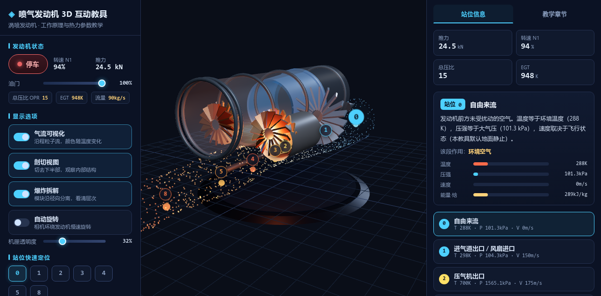

# 喷气发动机 3D 互动教具

面向机械、航空航天课程的交互式涡喷发动机教学模型。全程序化几何构建，零外部模型 / 图片 / 音频素材。

## 在线 Demo

> **在线体验**：https://teemaker-dev.github.io/jet-engine-teaching-aid/

## 预览




## 技术栈

- React 19 + TypeScript
- Three.js + @react-three/fiber + @react-three/drei
- zustand（跨 Canvas 与 UI 的共享状态）
- Vite 5

## 快速开始

```bash
npm install
npm run dev        # 开发服务器 → http://localhost:5173
npm run build      # 类型检查 + 生产构建 → dist/
npm run preview    # 预览生产构建
```

## 功能

### 交互控制（桌面左侧栏 / 移动端底部抽屉）
- **启动 / 停车**：转子转速平滑爬升，燃烧室与排气辉光随油门点亮
- **油门** 0~100%：转速 N1、推力、总压比、EGT、质量流量实时变化
- **气流可视化**：1500 粒子沿进气道→压气机→燃烧室→涡轮→喷管→尾喷流流动，
  颜色随流程由冷（蓝）到热（橙白）再略降温，流速随油门变化，含角动量守恒式旋流
- **爆炸拆解**：进气道 / 风扇 / 六级压气机 / 燃烧室 / 两级涡轮 / 喷管 / 机匣 / 主轴沿径向分离
- **剖切视图**：裁剪平面切去下半部，露出内部截面
- **机匣透明度**：0~100% 滑杆调节半透明外壳
- **自动旋转**：相机环绕慢速旋转

### 站位信息（0 / 1 / 2 / 3 / 4 / 5 / 8）
- 3D 场景内站位标记可点击选中，模块同步高亮
- 右侧信息卡展示各站位 **温度 / 压强 / 速度 / 能量（焓）** 条形图，
  数值随油门实时更新；整机摘要（推力 / N1 / 总压比 / EGT）
- 教学简化热力模型（海平面静止标准大气，数值为示意值非特定型号真实数据）

### 章节教学（7 章）
工作原理·布莱顿循环 / 进气道 / 压气机 / 燃烧室 / 涡轮 / 喷管 / 性能参数

## 布局与适配

- **桌面端（≥1024px）**：左（控制面板）— 中（3D 场景）— 右（站位信息 / 教学章节）三栏
- **移动端（<1024px）**：控制面板转为底部抽屉，站位信息转为可折叠右上浮层，
  顶部显示「建议使用电脑端打开，获得更完整的 3D 交互体验」提示（可关闭并记忆），
  适配 `safe-area-inset-*` 与触控操作

## 无障碍

- 全部按钮 / 开关 / 滑杆带 `aria-pressed` / `aria-checked` / `aria-valuetext` 与可聚焦样式
- 关键状态（启动 / 停车、站位切换）通过 `aria-live` 播报
- 键盘：`Space` 启动 / 停车，`↑ / ↓` 调节油门
- 支持 `prefers-reduced-motion`（关闭装饰性动画）

## 性能

- 叶片采用 InstancedMesh 批量渲染（14 次 draw call 覆盖全部叶片）
- `dpr` 上限 2、阻尼轨道控制、粒子单 BufferGeometry 就地更新
- 生产包约 1.09 MB（gzip 308 KB），无外部请求

## 项目结构

```
src/
  engine/     Three.js 场景、几何构建、动画与热力模型
  data/       站位信息、教学章节、参数模型
  ui/         React 界面组件（控制面板 / 信息卡 / 教学章节）
  App.tsx     三栏布局（桌面）/ 底部抽屉（移动端）
```

## 许可

MIT © 2026 Zhou Jianyong。教学与学习用途自由使用、修改、分发。
